# 💇‍♀️ HairGest - API Peluquería

## 📋 Descripción del Proyecto
Aplicación completa para la gestión de múltiples peluquería que permite:
- Gestión de usuarios (clientes, profesionales, administradores)
- Reserva y gestión de citas
- Administración de servicios, profesionales, centros y horarios
- Sistema de fidelización con puntos y niveles
- Notificaciones automáticas en tiempo real
- Panel de administración completo

## 🎯 Problema que Resolver
Automatizar la gestión de una peluquería, permitiendo a los clientes reservar citas online, a los profesionales gestionar su agenda, y a los administradores controlar todos los aspectos del negocio (servicios, profesionales, centros, horarios, usuarios) desde un panel unificado.

## ⚙️ Reglas de Negocio

### 👥 Usuarios
- **Registro**: Email único, contraseña encriptada con bcrypt
- **Roles**: Cliente, Profesional, Administrador
- **Estados**: Activo/Inactivo (no pueden acceder si están inactivos)
- **Eliminación**:
    - Si se elimina un **cliente**: Sus citas futuras se cancelan, se notifica a profesionales y admins
    - Si se elimina un **profesional**: Se borran sus relaciones, horarios, y se cancelan sus citas futuras notificando a clientes
    - Si se elimina un **admin**: Requiere validación especial

### 📅 Citas
- **Disponibilidad**: No se pueden crear citas duplicadas (mismo profesional, fecha, hora)
- **Estados**: Pendiente → Confirmada → Realizada | Cancelada
- **Cancelación**: Depende del rol:
    - Cliente cancela → Notifica a profesional y admins
    - Profesional cancela → Notifica a cliente y admins
    - Admin cancela → Notifica a cliente y profesional
    - **Admin marca día festivo** → Cancela automáticamente citas pendientes y notifica a clientes
- **Citas pasadas**: No se pueden modificar
- **Datos históricos**: Al eliminar un usuario/profesional/servicio/centro, las citas conservan los nombres

### ⭐ Sistema de Fidelización
- **Puntos**: +10 puntos por cita realizada
- **Niveles**:
    - 0-19 puntos: Cliente Nuevo
    - 20-49 puntos: Cliente Frecuente
    - 50-99 puntos: Cliente Habitual
    - 100+ puntos: Cliente Premium
- **Notificaciones**: Al ganar puntos o subir de nivel se felicita al cliente

### 🕐 Horarios
- **Solapamiento**: No se permiten horarios que se solapen para el mismo profesional
- **Días**: Array de días de la semana
- **Festivos**: Se pueden marcar fechas específicas como no laborables
- **Cancelación automática por festivo**: 
    - Al marcar un día como festivo, se cancelan automáticamente las citas **pendientes** de ese día
    - **No se permite** marcar como festivo si hay citas **confirmadas** (se debe cancelar manualmente primero)
    - Se notifica automáticamente a los clientes afectados con el título: *"Cita cancelada por festivo"*
    - Se notifica al profesional sobre el día festivo agregado

### 🔔 Notificaciones
- **Automáticas**: Se crean en cada evento importante (reserva, cancelación, confirmación, etc.)
- **Destinatarios**: Cliente, Profesional y/o Administradores según el caso
- **Tipos**: info, éxito, advertencia, error
- **Estado**: Leída/No leída
- **Notificaciones especiales**:
    - **Cliente**: "Cita cancelada por festivo" - Cuando el admin marca como festivo un día con cita pendiente
    - **Profesional**: "Día marcado como no laborable" - Cuando se añaden fechas festivas a su horario
    - **Cliente**: "Cita realizada" - Incluye puntos ganados y posible cambio de nivel

## 📊 Diagramas

### Diagrama de Entidades
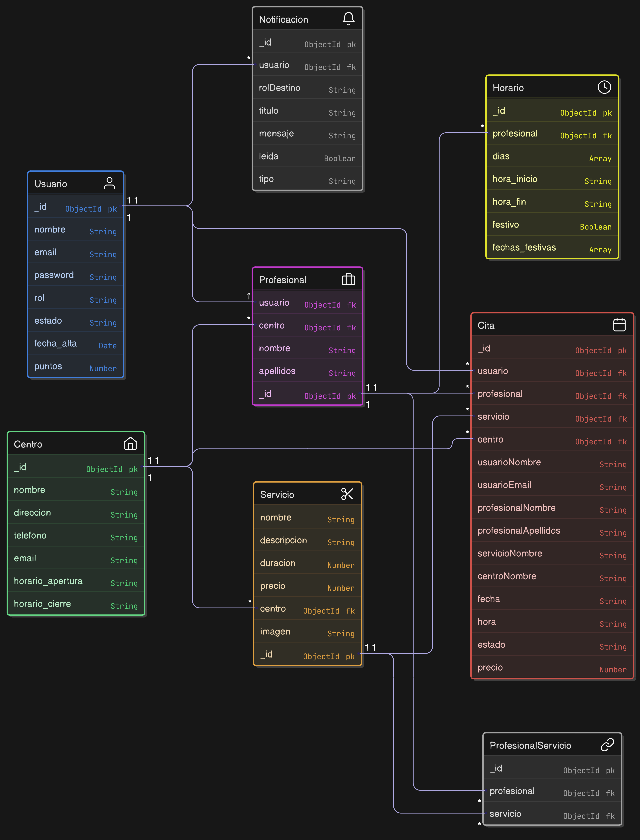

### Diagrama de Flujo de Cita
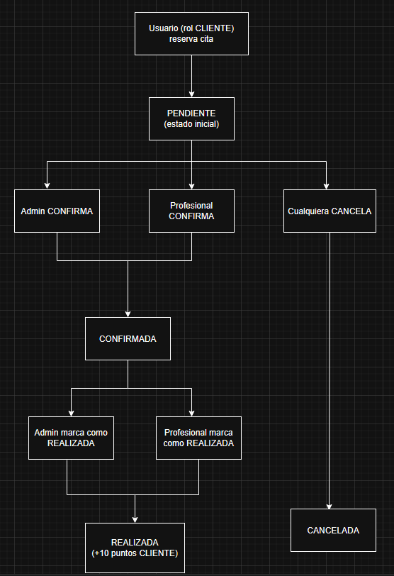

### Diagrama de Estados de Usuario
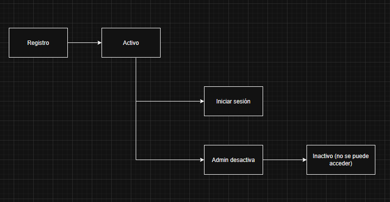

## 📊 Entidades y Campos

### 👤 Usuario
- **_id**: ObjectId - Identificador único
- **nombre**: String - Nombre completo
- **email**: String - Email único
- **password**: String - Contraseña encriptada
- **rol**: Enum - cliente / profesional / administrador
- **estado**: Enum - activo / inactivo
- **fecha_alta**: Date - Fecha de registro
- **puntos**: Number - Puntos acumulados (solo clientes)

### 💼 Profesional
- **_id**: ObjectId - Identificador único
- **usuario**: ObjectId - Referencia a Usuario
- **centro**: ObjectId - Referencia a Centro
- **nombre**: String - Nombre
- **apellidos**: String - Apellidos

### ✂️ Servicio
- **_id**: ObjectId - Identificador único
- **nombre**: String - Nombre del servicio
- **descripcion**: String - Descripción
- **duracion**: Number - Duración en minutos
- **precio**: Number - Precio en euros
- **centro**: ObjectId - Referencia a Centro
- **imagen**: String - URL de la imagen

### 🏢 Centro
- **_id**: ObjectId - Identificador único
- **nombre**: String - Nombre del centro
- **direccion**: String - Dirección completa
- **telefono**: String - Teléfono de contacto
- **email**: String - Email de contacto
- **horario_apertura**: String - Hora de apertura (HH:MM)
- **horario_cierre**: String - Hora de cierre (HH:MM)

### 📅 Cita
- **_id**: ObjectId - Identificador único
- **usuario**: ObjectId - Referencia a Usuario
- **profesional**: ObjectId - Referencia a Profesional
- **servicio**: ObjectId - Referencia a Servicio
- **centro**: ObjectId - Referencia a Centro
- **fecha**: String - Fecha (YYYY-MM-DD)
- **hora**: String - Hora (HH:MM)
- **estado**: Enum - pendiente / confirmada / realizada / cancelada
- **precio**: Number - Precio en el momento de la reserva
- **usuarioNombre**: String - Histórico
- **usuarioEmail**: String - Histórico
- **profesionalNombre**: String - Histórico
- **profesionalApellidos**: String - Histórico
- **servicioNombre**: String - Histórico
- **centroNombre**: String - Histórico

### 🕐 Horario
- **_id**: ObjectId - Identificador único
- **profesional**: ObjectId - Referencia a Profesional
- **dias**: [String] - Días de la semana
- **hora_inicio**: String - Hora inicio (HH:MM)
- **hora_fin**: String - Hora fin (HH:MM)
- **festivo**: Boolean - Es festivo
- **fechas_festivas**: [String] - Fechas específicas no laborables

### 🔔 Notificación
- **_id**: ObjectId - Identificador único
- **usuario**: ObjectId - Referencia a Usuario
- **rolDestino**: Enum - cliente / profesional / administrador
- **titulo**: String - Título de la notificación
- **mensaje**: String - Contenido (puede incluir HTML)
- **leida**: Boolean - Estado de lectura
- **tipo**: Enum - info / exito / advertencia / error

### 🔗 Profesional-Servicio
- **_id**: ObjectId - Identificador único
- **profesional**: ObjectId - Referencia a Profesional
- **servicio**: ObjectId - Referencia a Servicio

## 🌐 Endpoints de la API

### 🔐 Autenticación
- **POST** `/api/login` - Iniciar sesión
- **POST** `/api/registro` - Registrar nuevo usuario

### 👥 Usuarios
- **GET** `/api/usuarios` - Obtener todos los usuarios
- **PUT** `/api/usuarios/:id` - Actualizar usuario
- **DELETE** `/api/usuarios/:id` - Eliminar usuario

### ✂️ Servicios
- **GET** `/api/servicios` - Obtener todos los servicios
- **POST** `/api/servicios` - Crear servicio
- **PUT** `/api/servicios/:id` - Actualizar servicio
- **DELETE** `/api/servicios/:id` - Eliminar servicio

### 💼 Profesionales
- **GET** `/api/profesionales` - Obtener todos los profesionales
- **GET** `/api/profesionales/:id` - Obtener profesional por ID
- **POST** `/api/profesionales` - Crear profesional
- **PUT** `/api/profesionales/:id` - Actualizar profesional
- **DELETE** `/api/profesionales/:id` - Eliminar profesional

### 🏢 Centros
- **GET** `/api/centros` - Obtener todos los centros
- **GET** `/api/centros/:id` - Obtener centro por ID
- **POST** `/api/centros` - Crear centro
- **PUT** `/api/centros/:id` - Actualizar centro
- **DELETE** `/api/centros/:id` - Eliminar centro

### 🕐 Horarios
- **GET** `/api/horarios` - Obtener todos los horarios
- **GET** `/api/horarios/:id` - Obtener horario por ID
- **POST** `/api/horarios` - Crear horario
- **PUT** `/api/horarios/:id` - Actualizar horario
- **DELETE** `/api/horarios/:id` - Eliminar horario

### 📅 Citas
- **GET** `/api/citas` - Obtener todas las citas
- **GET** `/api/citas/:id` - Obtener cita por ID
- **GET** `/api/citas/usuario/:usuarioId` - Citas de un usuario
- **GET** `/api/citas/profesional/:profesionalId` - Citas de un profesional
- **POST** `/api/citas` - Crear cita
- **PUT** `/api/citas/:id` - Actualizar cita
- **DELETE** `/api/citas/:id` - Eliminar cita
- **PUT** `/api/citas/:id/marcar-realizada` - Marcar como realizada (+10 puntos)
- **GET** `/api/citas/disponibilidad/:profesionalId/:fecha/:hora` - Verificar disponibilidad

### 🔔 Notificaciones
- **GET** `/api/notificaciones/usuario/:id` - Notificaciones de usuario
- **GET** `/api/notificaciones/usuario/:id/no-leidas` - No leídas
- **GET** `/api/notificaciones/usuario/:id/contar-no-leidas` - Contador no leídas
- **POST** `/api/notificaciones` - Crear notificación
- **PUT** `/api/notificaciones/:id/marcar-leida` - Marcar como leída
- **PUT** `/api/notificaciones/usuario/:id/marcar-todas-leidas` - Marcar todas leídas
- **DELETE** `/api/notificaciones/:id` - Eliminar notificación
- **DELETE** `/api/notificaciones/usuario/:id` - Eliminar todas

### 🔗 Profesional-Servicio
- **GET** `/api/profesional_servicio` - Todas las relaciones
- **POST** `/api/profesional_servicio` - Crear relación
- **DELETE** `/api/profesional_servicio/:id` - Eliminar relación
- **DELETE** `/api/profesional_servicio/servicio/:servicioId` - Eliminar por servicio
- **DELETE** `/api/profesional_servicio/profesional/:profesionalId` - Eliminar por profesional

## 📦 Despliegue

### 🔗 URLs de la API
- **Raíz de la API**: `http://localhost:3001` (mensaje de bienvenida)
- **Base para endpoints**: `http://localhost:3001/api` (ej: /api/servicios, /api/usuarios...)
- **Producción**: `https://hairgest-backend.vercel.app`
- **Producción para endpoints**: `https://hairgest-backend.vercel.app/api`

### 💻 Frontend Angular
- **Local**: `http://localhost:4200`
- **Producción**: `https://hairgest-angular.vercel.app`

### ⚛️ Frontend React
- **Local**: `http://localhost:5173` (o el puerto que uses)
- **Producción**: `https://frontend-react-delta-eight.vercel.app/`

## 📸 Capturas de Pantalla

### Panel de Administración
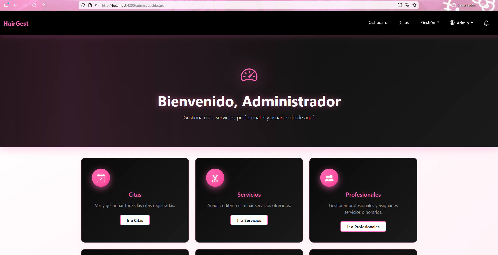
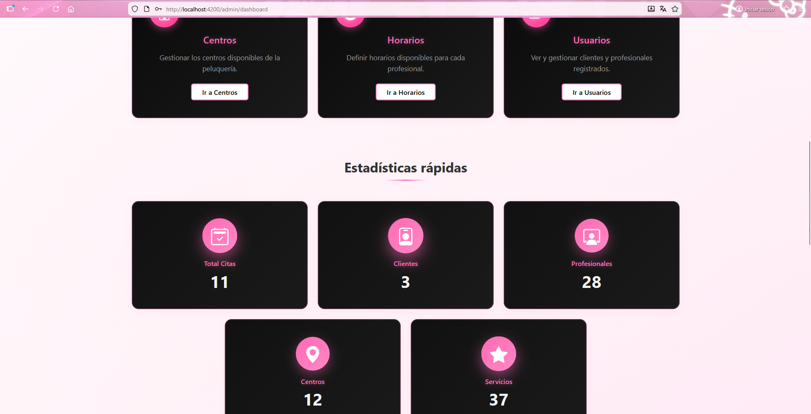
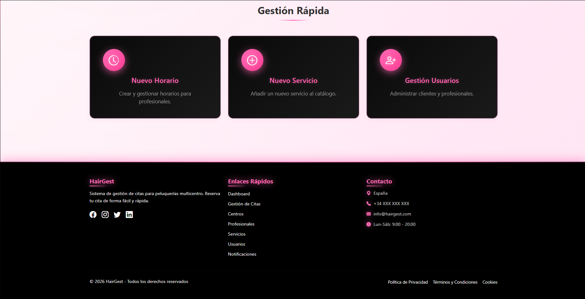

### Panel de Profesinal
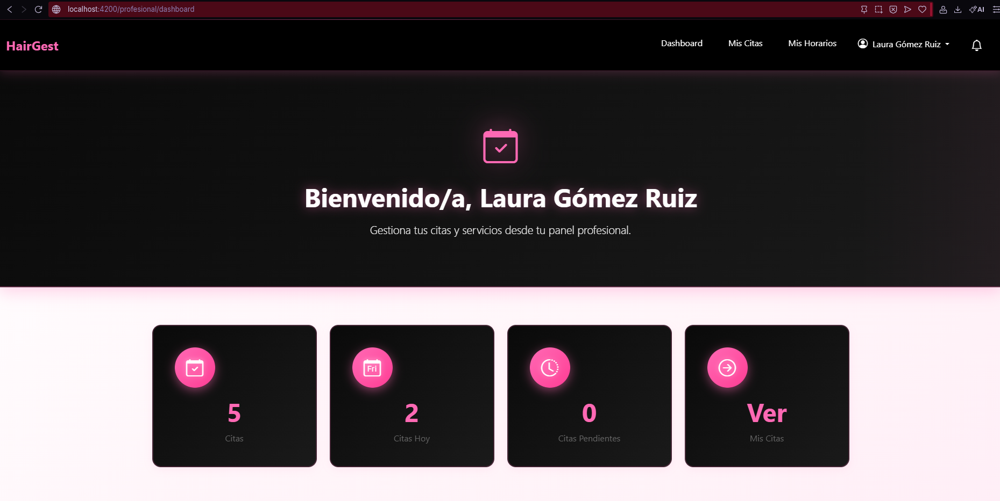
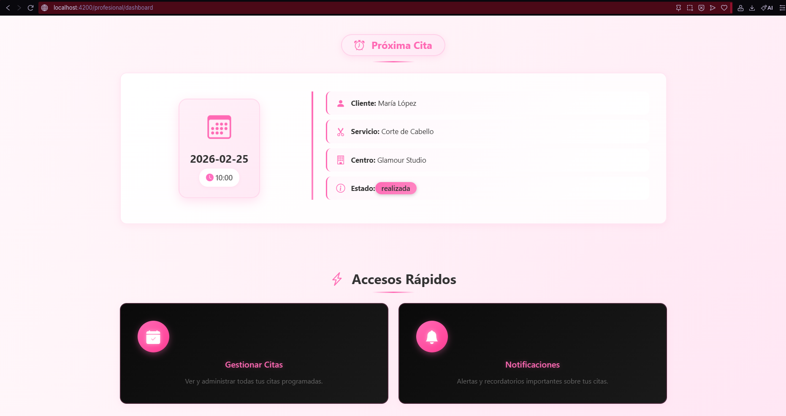
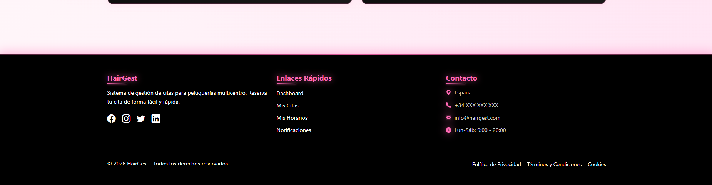

### Gestión de Citas
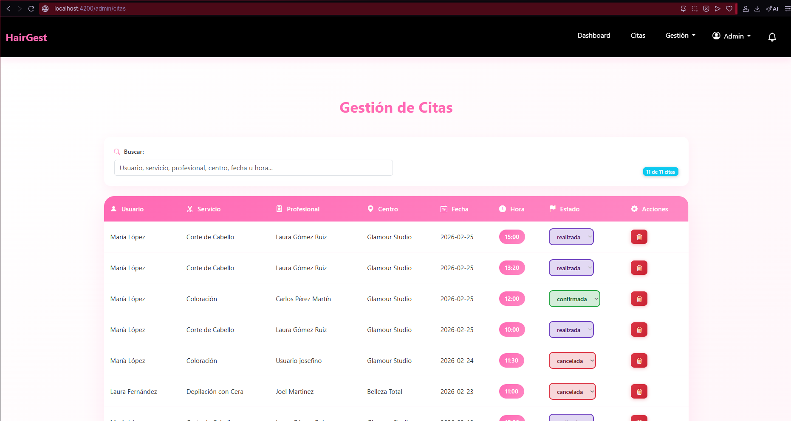

### Notificaciones
**Cliente**:
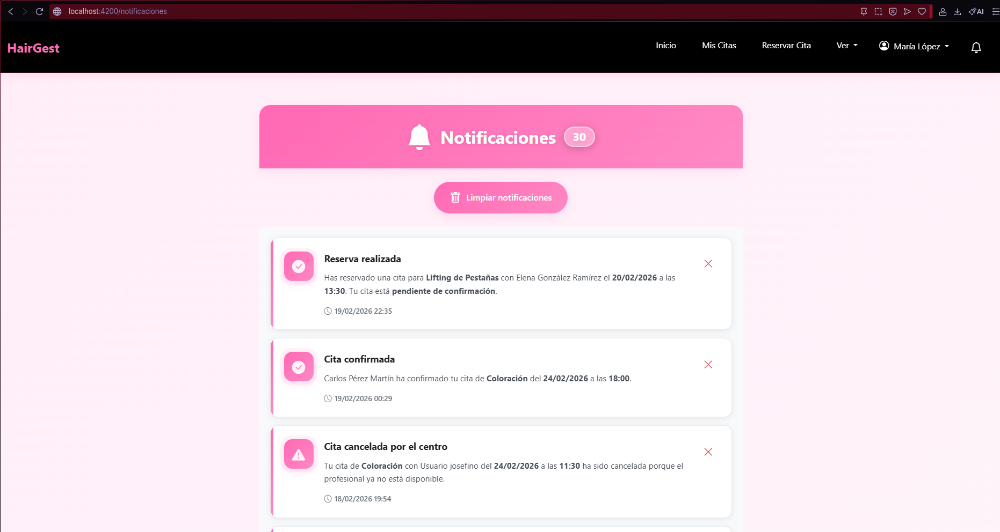

**Profesional**:
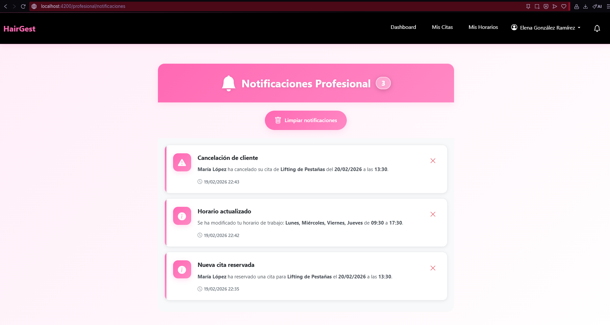

**Administrador**:
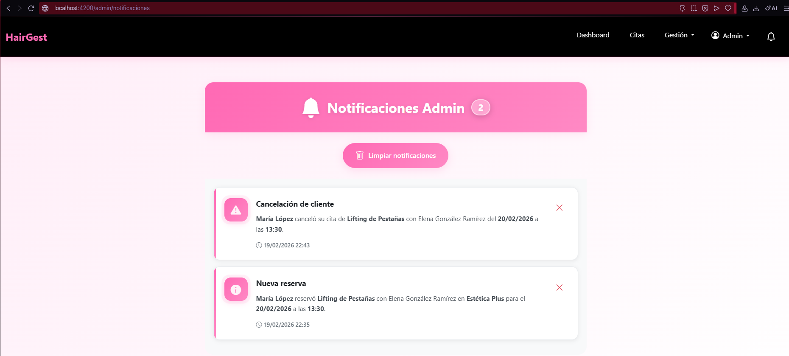

### Sistema de Puntos y Niveles
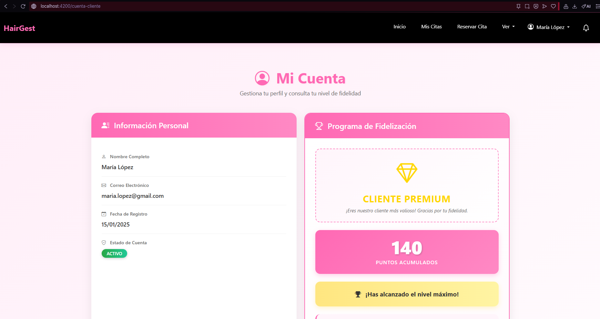
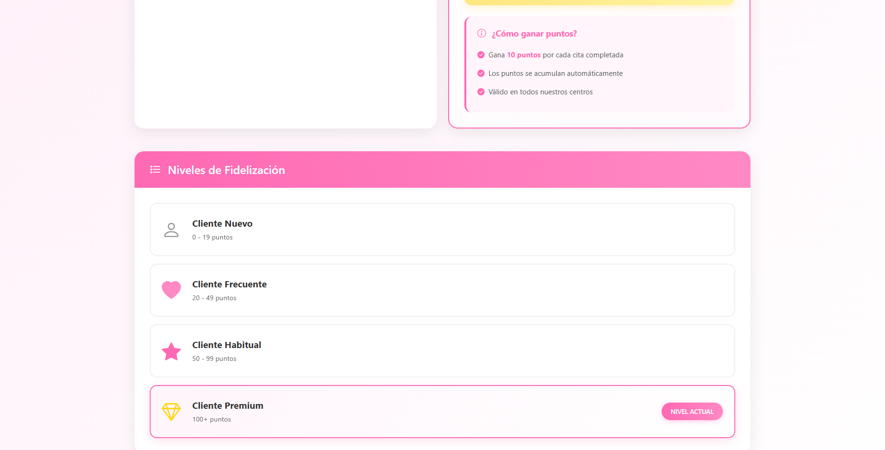

